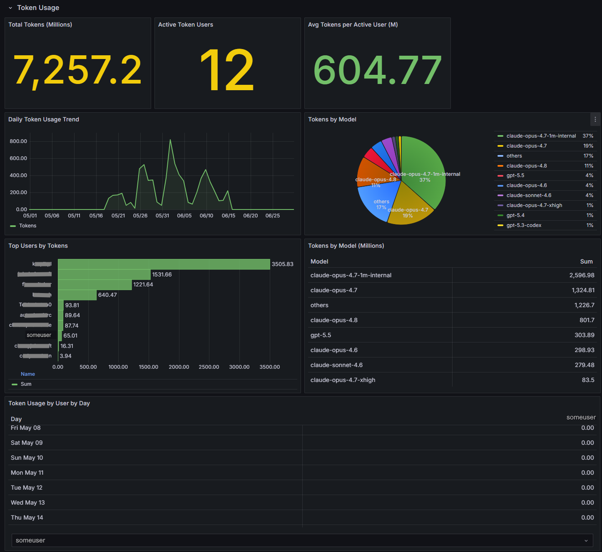

# Copilot Usage Advanced Dashboard Tutorial

[repo-home]: https://github.com/lluppesms/copilot-usage-advanced-dashboard
[repo-issues]: https://github.com/lluppesms/copilot-usage-advanced-dashboard/issues/new

<!-- 
[fork-from-repo-home]: https://github.com/satomic/copilot-usage-advanced-dashboard
[fork-from-repo-issues]: https://github.com/satomic/copilot-usage-advanced-dashboard/issues/new 
-->

> ⚠️**Disclaimer**: This project is open sourced to solve problems that are critical to some users, and the functions provided may not be natively provided by GitHub Copilot. Therefore the contents,  opinions and views expressed in this project are solely mine do not necessarly refect the views of my employer, These are my personal notes based on myunderstanding of the code and trial deployments to GitHub Copilot. If anything is wrong with this article, please let me know through the [issues][repo-issues]. l appreciate your help in correcting my understanding.

> ✅ **Risk Warning**: This project uses the standard Copilot REST API to obtain data, aggregate data, and visualize it, without any potential risks.

---

> 🛑 **Warning!** June 16 (lluppes) - I added Token Usage and AI Credit info to the dashboards, but I'm not sure if the data is accurate, so I suggest you take a cautious attitude towards these two parts for the time being. It's showing data, but it seems to be incomplete. I will continue to verify the data and optimize the visualization of these two parts in the future.

---

<!-- [Copilot Usage Advanced Dashboard 教程](https://www.wolai.com/tNxKtCqCfb6DR2cuaxmJDZ) -->

## Table of contents

- **[Version History](docs/version-history.md)**
<!-- - [Online Demo Environment ✨](#online-demo-environment) -->
- [🚀 Quick Start - How to run locally](./docs/run-locally.md)
- [🧪 Testing Guide](./docs/testing-guide.md)
- [Introduction](#introduction)
  - [Copilot Usage Advanced Dashboard](#copilot-usage-advanced-dashboard)
- [Features](#features)
  - [0. Filtering](#filtering-variables)
  - [1. Organization](#1-organization)
  - [2. Teams](#2-teams)
  - [3. Languages](#3-languages)
  - [4. Editors](#4-editors)
  - [5. Copilot Chat](#5-copilot-chat)
  - [6. Seat Analysis](#6-seat-analysis)
  - [7. Breakdown Heatmap](#7-breakdown-heatmap)
  - [8. User Metrics Analytics](#8-user-metrics-analytics)
  - [9. Copilot Seat Info & Top Languages](#9-copilot-seat-info--top-languages)
  - [10. Copilot Usage Total Insight](#10-copilot-usage-total-insight)
  - [11. Copilot Usage Breakdown Insight](#11-copilot-usage-breakdown-insight)
  - [12. AI Credits (Usage-Based Billing)](#12-ai-credits-usage-based-billing)
  - [13. Token Usage](#13-token-usage)
- [Deployment Methods](#deployment-methods)
  - [Deploy from workstation with `azd up`](./docs/azd-up-guide.md)
  - [Deploy with an Azure DevOps Pipeline](./docs/azdo-pipeline-guide.md)
  - [Deploy with a GitHub Action](./docs/github-actions-guide.md)
- [Azure Security Roles for Deployment](#azure-security-roles)
- [Deployment Options](#deployment-options)
  - [1. Azure Container Apps](#1-azure-container-apps)
  - [2. Linux with Docker](#2-linux-with-docker)
  - [3. Kubernetes](#3-kubernetes)
- [Congratulations!](#congratulations)

---

# Introduction

[Copilot Usage Advanced Dashboard][repo-home] is a single data panel display that almost fully utilizes data from Copilot APIs, The APIs used are:

- [List teams of an organization](https://docs.github.com/en/enterprise-cloud@latest/rest/teams/teams?apiVersion=2022-11-28#list-teams)
- [Get a summary of Copilot metrics for a team](https://docs.github.com/en/enterprise-cloud@latest/rest/copilot/copilot-metrics?apiVersion=2022-11-28#get-copilot-metrics-for-a-team)
- [Get Copilot seat information and settings for an organization](https://docs.github.com/en/enterprise-cloud@latest/rest/copilot/copilot-user-management?apiVersion=2022-11-28#get-copilot-seat-information-and-settings-for-an-organization)
- [List all Copilot seat assignments for an organization](https://docs.github.com/en/enterprise-cloud@latest/rest/copilot/copilot-user-management?apiVersion=2022-11-28#list-all-copilot-seat-assignments-for-an-organization)
- [**NEW in v1.8** - Get Copilot User Metrics (28-day rolling window)](https://docs.github.com/en/enterprise-cloud@latest/rest/copilot/copilot-usage?apiVersion=2022-11-28#get-a-summary-of-copilot-user-metrics)

This represents Copilot usage in multi organizations & teams from different dimensions. The features are summarized as follows:

- Data is persisted in Elasticsearch and visualized in Grafana, **not just the past 28 days**. So you can freely choose the time period you want to visualize, such as the past year or a specific month.
- You can freely adjust the style and theme of the chart, everything is a mature feature of Grafana.
- All stored data includes Organization and Team fields, which is convenient for data filtering through variable filters.
- Generate a unique hash key for each piece of data, and update the stored data every time the latest data is obtained.
- Visualizations in Grafana dashboards can be adjusted or deleted according to actual needs.
- Based on Grafana's built-in alerting function, you can set alert rules for some inappropriate usage behaviors, such as sending alerts to users who have been inactive for a long time.
- It can be easily integrated with third-party systems, whether it is extracting data from Elasticsearch to other data visualization platforms for data visualization, or adding other data sources in the Copilot Usage Advanced Dashboard for joint data visualization.

<!-- ## Online Demo Environment

> Designed 2 dashboards, both can exist at the same time in Grafana.

### Copilot Usage Advanced Dashboard

> Copilot Metrics Viewer compatible dashboard

> If you are familiar with the [copilot-metrics-viewer](https://github.com/github-copilot-resources/copilot-metrics-viewer) project, then please try this dashboard and use it in subsequent deployments.

- link: [copilot-usage-advanced-dashboard](https://softrin.com/d/be7hpbvvhst8gc/copilot-usage-advanced-dashboard)
- username：`demouser`
- password：`demouser`

  

### Copilot Usage Advanced Dashboard Original

> New designed dashboard&#x20;

- Link: [copilot-usage-advanced-dashboard-original](https://softrin.com/d/a98455d6-b401-4a53-80ad-7af9f97be6f4/copilot-usage-advanced-dashboard-original)
- username：`demouser`
- password：`demouser`

  
 -->
 
# Filtering Variables

Supports four filtering variables, namely

- Organization
- Team
- Language
- Editor

The choice of variables is dynamically associated with the data display

# Features

## Copilot Usage Advanced Dashboard

### 1. Organization

> First, based on [List teams of an onganization](https://docs.github.com/en/enterprise-cloud@latest/rest/teams/teams?apiVersion=2022-11-28#list-teams), get all the teams under the Organization, and then based on [Get a summary of Copilot usage for a team](https://docs.github.com/en/enterprise-cloud@latest/rest/copilot/copilot-usage?apiVersion=2022-11-28#get-a-summary-of-copilot-usage-for-a-team), sum and calculate the data of all teams under the Organization to get complete Organization-level data.

Calculation Details

- Acceptance Rate Average = `sum(total_acceptances_count) / sum(total_suggestions_count)`
- Cumulative Number of Acceptence (Count) = `sum(total_acceptances_count)`
- Cumulative Number of Suggestions (Count) = `sum(total_suggestions_count)`
- Cumulative Number of Lines of Code Accepted = `sum(total_lines_accepted)`
- Acceptance Rate (%) = `total_acceptances_count / total_suggestions_count`
- Total Active Users = `total_active_users`
- Total Suggestions & Acceptances Count = `total_suggestions_count` & `total_acceptances_count`
- Total Lines Suggested & Accepted = `total_lines_suggested `& `total_lines_accepted`

### 2. Teams

> Based on the breakdown data in [Get a summary of Copilot usage for a team](https://docs.github.com/en/enterprise-cloud@latest/rest/copilot/copilot-usage?apiVersion=2022-11-28#get-a-summary-of-copilot-usage-for-a-team), the data is aggregated by Teams to obtain data comparisons of different Teams.

Calculation Details

- Number of Teams = `unique_count(team_slug)`
- Top Teams by Accepted Prompts = `sum(acceptances_count).groupby(team_slug)`
- Top Teams by Acceptance Rate = `sum(acceptances_count).groupby(team_slug) / sum(suggestions_count).groupby(team_slug)`
- Team Breakdown = `sum(*).groupby(team_slug)`

### 3. Languages

> Based on the breakdown data in [Get a summary of Copilot usage for a team](https://docs.github.com/en/enterprise-cloud@latest/rest/copilot/copilot-usage?apiVersion=2022-11-28#get-a-summary-of-copilot-usage-for-a-team), the data is aggregated according to Languages ​​to obtain data comparisons for different Languages.

Calculation Details

- Number of Languages= `unique_count(language)`
- Top Languages by Accepted Prompts = `sum(acceptances_count).groupby(language)`
- Top Languages by Acceptance Rate = `sum(acceptances_count).groupby(language) / sum(suggestions_count).groupby(language)`
- Languages Breakdown = `sum(*).groupby(language)`

### 4. Editors

> Based on the breakdown data in [Get a summary of Copilot usage for a team](https://docs.github.com/en/enterprise-cloud@latest/rest/copilot/copilot-usage?apiVersion=2022-11-28#get-a-summary-of-copilot-usage-for-a-team), the data is aggregated by Editors to obtain data comparisons for different Editors.

Calculation Details

- Number of Editors = `unique_count(editor)`
- Top Editors by Accepted Prompts = `sum(acceptances_count).groupby(editor)`
- Top Editors by Acceptance Rate = `sum(acceptances_count).groupby(editor) / sum(suggestions_count).groupby(editor)`
- Editors Breakdown = `sum(*).groupby(editor)`

### 5. Copilot Chat

> Based on the data from [Get a summary of Copilot usage for a team](https://docs.github.com/en/enterprise-cloud@latest/rest/copilot/copilot-usage?apiVersion=2022-11-28#get-a-summary-of-copilot-usage-for-a-team), we can get the usage of Copilot Chat.

Calculation Details

- Acceptance Rate Average = `sum(total_chat_acceptances) / sum(total_chat_turns)`
- Cumulative Number of Acceptances = `sum(total_chat_acceptances)`
- Cumulative Number of Turns = `sum(total_chat_turns)`
- Total Acceptances | Total Turns Count = `total_chat_acceptances` | `total_chat_turns`
- Total Active Copilot Chat Users = `total_active_chat_users`

### 6. Seat Analysis

> Based on the data analysis of [Get Copilot seat information and settings for an organization](https://docs.github.com/en/enterprise-cloud@latest/rest/copilot/copilot-user-management?apiVersion=2022-11-28#get-copilot-seat-information-and-settings-for-an-organization) and [List all Copilot seat assignments for an organization](https://docs.github.com/en/enterprise-cloud@latest/rest/copilot/copilot-user-management?apiVersion=2022-11-28#list-all-copilot-seat-assignments-for-an-organization), the seat allocation and usage are presented in a unified manner.

Calculation Details

- Copilot Plan Type = `count(seats).groupby(plan_type)`
- Total = `seat_breakdown.total`
- Active in this Cycle = `seat_breakdown.active_this_cycle`
- Assigned But Never Used = `last_activity_at.isnan()`
- Inactive in this Cycle = `seat_breakdown.inactive_this_cycle`
- Ranking of Inactive Users ( ≥ 2 days ) =  `today - last_activity_at`
- All assigned seats = `*`

### 7. Breakdown Heatmap

> Based on the breakdown data in [Get a summary of Copilot usage for a team](https://docs.github.com/en/enterprise-cloud@latest/rest/copilot/copilot-usage?apiVersion=2022-11-28#get-a-summary-of-copilot-usage-for-a-team), we analyze the data from two dimensions: Languages ​​and Editors. We can clearly see what combination of Languages ​​and Editors can achieve the best Copilot usage effect.

Calculation Details

- Active Users Count (Group by Language) = `active_users.groupby(language)`
- Accept Rate by Count (%) = `sum(acceptances_count).groupby(language) / sum(suggestions_count).groupby(language)`
- Accept Rate by Lines (%) = `sum(lines_accepted).groupby(language) / sum(lines_suggested).groupby(language)`
- Active Users Count (Group by Editor) = `active_users.groupby(editor)`
- Accept Rate by Count (%) = `sum(acceptances_count).groupby(editor) / sum(suggestions_count).groupby(editor)`
- Accept Rate by Lines (%) = `sum(lines_accepted).groupby(editor) / sum(lines_suggested).groupby(editor)`

### 8. User Metrics Analytics

> **NEW in v1.8**: Complete user-level analytics powered by GitHub Copilot User Metrics API. Track individual user adoption, engagement patterns, and feature utilization with automated hourly updates.

Based on the data from [Get Copilot User Metrics](https://docs.github.com/en/enterprise-cloud@latest/rest/copilot/copilot-usage?apiVersion=2022-11-28#get-a-summary-of-copilot-user-metrics), this module provides comprehensive per-user analytics including:

#### Summary Panels & Detailed User Analytics

**Four key metric panels provide at-a-glance insights:**

Calculation Details

- **Total Users** = `cardinality(user_login)` - Unique count of users with Copilot activity in the selected time range
- **Total Suggestions** = `sum(code_generation_activity_count)` - Total number of code suggestions generated across all users
- **Total Acceptances** = `sum(code_acceptance_activity_count)` - Total number of code suggestions accepted by users
- **Acceptance Rate** = `sum(code_acceptance_activity_count) / sum(code_generation_activity_count)` - Overall acceptance percentage showing code quality and relevance

**Comprehensive per-user breakdown with sortable columns:**

Calculation Details

- **User** - GitHub username/login
- **User Initiated Interactions** = `sum(user_initiated_interaction_count)` - Direct user actions requesting Copilot suggestions
- **Code Suggestions Generated** = `sum(code_generation_activity_count)` - Number of code completions offered to the user
- **Code Suggestions Accepted** = `sum(code_acceptance_activity_count)` - Number of suggestions the user accepted
- **Average LOC Suggested** = `avg(loc_suggested_to_add_sum)` - Average lines of code suggested per interaction
- **Average LOC Added** = `avg(loc_added_sum)` - Average lines of code actually added from suggestions
- **Agent Usage** = `sum(used_agent)` - Count of Copilot Agent feature usage (GitHub Copilot Workspace, CLI, etc.)
- **Chat Usage** = `sum(used_chat)` - Count of Copilot Chat interactions
- **Active Days** = `cardinality(day)` - Number of distinct days the user engaged with Copilot

#### Activity Visualizations & Top 10 Users Leaderboard

**Two time-series charts show engagement patterns:**

More Details

**Daily Active Users:**

- Line chart showing unique user count per day
- Helps identify usage trends, peak days, and adoption velocity
- Formula: `cardinality(user_login)` per day

**Code Generation & Acceptance Activity:**

- Dual-line chart comparing suggestions generated (green) vs accepted (yellow)
- Reveals code quality trends and user satisfaction over time
- Green line: `sum(code_generation_activity_count)` per day
- Yellow line: `sum(code_acceptance_activity_count)` per day

**Horizontal bar chart showcasing top performers by adoption percentage:**

- **Adoption Score** = `(active_days / $__rangeDays) × 100` - Percentage of the distinct active days inside the range you have selected in Grafana (the denominator is computed from Grafana’s `$__rangeDays` so it matches 30, 90, 365-day filters automatically).
- The Top 10 panel now runs directly on `copilot_user_metrics`, counts the unique `day` values per user inside the range, and normalizes by the computed range length (`$__rangeDays`). That way the percentage re-scales whenever you change the dashboard period even though the raw documents still come from repeated 28-day API snapshots stored in Elasticsearch.
- **Activity Score A (0-100)** *(v1.9)*: `40% × (active_days/range_days) + 35% × norm(accepted_per_active_day) + 25% × norm(chat_per_active_day)` — stored as `activity_score_pct` in `copilot_user_adoption`.
- **Reliance Score B (0-100 proxy)** *(v1.9)*: normalized `loc_added / loc_suggested` (line acceptance rate). Stored as `reliance_score_pct`. Note: true “Copilot lines / total lines added” requires git history data unavailable from the Copilot API.
- Color-coded gradient indicating engagement level:
  - 🔴 Red (0-40%): Needs attention - may require training or support
  - 🟠 Orange (40-60%): Moderate usage - room for improvement
  - 🟡 Yellow (60-80%): Good engagement - regular user
  - 🟢 Green (80-95%): Excellent adoption - heavy user
  - 🔵 Blue (95-100%): Power user - Copilot champion candidate

**Automated Data Collection:**

- Runs every hour (configurable via `EXECUTION_INTERVAL_HOURS`)
- Fetches 28-day rolling window data from GitHub API
- Calculates adoption scores automatically
- Stores in 4 Elasticsearch indexes: `copilot_user_metrics` (raw data), `copilot_user_adoption` (leaderboard scores), `copilot_pr_reviews` (PR usage by Copilot), `copilot_dotcom_chat` (GitHub.com chat)
- No manual intervention required

**Use Cases:**

- Identify power users and champions for Copilot evangelism
- Track onboarding progress for new Copilot users
- Spot users who need additional training or support
- Measure team-level adoption trends over time
- Monitor Chat and Agent feature adoption rates
- Correlate active days with productivity metrics
- Generate executive reports on Copilot ROI

### 9. Copilot Seat Info & Top Languages

- You can view the distribution of seats, Enterprise or Business? and overall activation trends. And for users who don't use Copilot, they are ranked based on the length of inactivity and list users who have never activated.
- Ranking Language and Teams based on usage

### 10. Copilot Usage Total Insight

You can analyze the total number of recommendations and adoption rate trends based on Count Lines and Chats

### 11. Copilot Usage Breakdown Insight

You can analyze the effect of Copilot in different languages ​​and different editor combinations.

### 12. AI Credits (Usage-Based Billing)

> **NEW in v1.10**: Usage-Based Billing (UBB) analytics that surface **per-user AI credit consumption** instead of monetary cost. Data is ingested from the GitHub billing API into the `copilot_ai_credit_usage` (line-item grain) and `copilot_ai_credit_user_daily` (daily per-user rollup) Elasticsearch indexes. Historical backfill is controlled by `BILLING_BACKFILL_START_DATE`.

This row shows how AI credits are being consumed across organizations, models, and products so you can understand adoption and consumption patterns under the UBB model.

Calculation Details

- **Total AI Credits** = `sum(ai_credits_net)` - Net AI credits consumed across the selected time range
- **Active Credit Users** = `cardinality(user_login)` - Unique users with AI credit consumption
- **Avg Credits per Active User** = `sum(ai_credits_net) / cardinality(user_login)`
- **Daily AI Credits Trend** = `sum(ai_credits_net)` per day - Time-series of credit consumption
- **Credits by Model** = `sum(ai_credits_net).groupby(model)` - Consumption split across models
- **Top Users by Credits** = `sum(ai_credits_net).groupby(user_login)` - Leaderboard of heaviest credit consumers
- **Credits by Product/SKU** = `sum(ai_credits_net).groupby(sku)` - Consumption split across Copilot products
- **User-by-Day Credit Drilldown** - Per-user daily breakdown for detailed investigation

### 13. Token Usage

> **NEW in v1.10**: Token-level analytics derived from user metrics, stored in the `copilot_token_usage` and `copilot_token_user_daily` Elasticsearch indexes. Prompt and output token volume is allocated by model and language so you can see where token spend is concentrated.

This row complements AI Credits by showing the raw **prompt** and **output** token volume behind Copilot activity, reported in millions for readability.

Calculation Details

- **Total Tokens (Millions)** = `sum(token_total_million)` - Combined prompt + output tokens
- **Active Token Users** = `cardinality(user_login)` - Unique users generating token activity
- **Avg Tokens per Active User (M)** = `sum(token_total_million) / cardinality(user_login)`
- **Daily Token Usage Trend** = `sum(token_total)` per day - Time-series of token consumption
- **Tokens by Model** / **Tokens by Model (Millions)** = `sum(token_total).groupby(model)` - Consumption split across models
- **Top Users by Tokens** = `sum(token_total).groupby(user_login)` - Leaderboard of heaviest token consumers
- **Token Usage by User by Day** - Per-user daily prompt/output/total token breakdown

---

# Deployment Methods

[Deploy from workstation with `azd up`](./docs/azd-up-guide.md) The easiest way to deploy the entire application from your workstation in one step, no need to set up a CI/CD pipeline. Perfect for quick demos, POCs, or personal use, but not necessarily recommended for production environments.

[Deploy with an Azure DevOps Pipeline](./docs/azdo-pipeline-guide.md).

[Deploy with a GitHub Action](./docs/github-actions-guide.md).

---

# Azure Security Roles

## Deploying as `Contributor`

If you try to deploy this and you ONLY have the `contributor` role in the Azure subscription, it will fail.
The deployment adds required role assignments, which require either `User Access Administrator` RBAC role (in addition to `Contributor`) or `Owner` RBAC role (which includes User Access Administrator permissions).

To deploy as `Contributor` RBAC role, pass `doRoleAssignments` parameter set to `false` or set `AZURE_ROLE_ASSIGNMENTS` environment variable when deploying with `azd`. In that case, you will need to manually assign the following roles:

- **Key Vault Secrets Officer** on the KeyVault assigned to User Assigned Identity
- **AcrPull** on the Azure Container Registry assigned to User Assigned Identity
- **Storage File Data SMB Share Contributor** on the Storage Account assigned to User Assigned Identity

---

# Deployment Options

## 1. Azure Container Apps

If you are using Azure Container Apps, please refer to the [Azure Container Apps deployment document](deploy/azure-container-apps.md).

## 2. Linux with Docker

If you are not using Azure, you can use Linux with Docker, please refer to the [Linux with Docker deployment document](deploy/linux-with-docker.md).

## 3. Kubernetes

For cloud native deployment on Kubernetes,  please refer to the [Kubernetes deployment document](deploy/kubernetes.md).

---

# Congratulations!

At this point, return to the Grafana page and refresh. You should be able to see the data.

or

